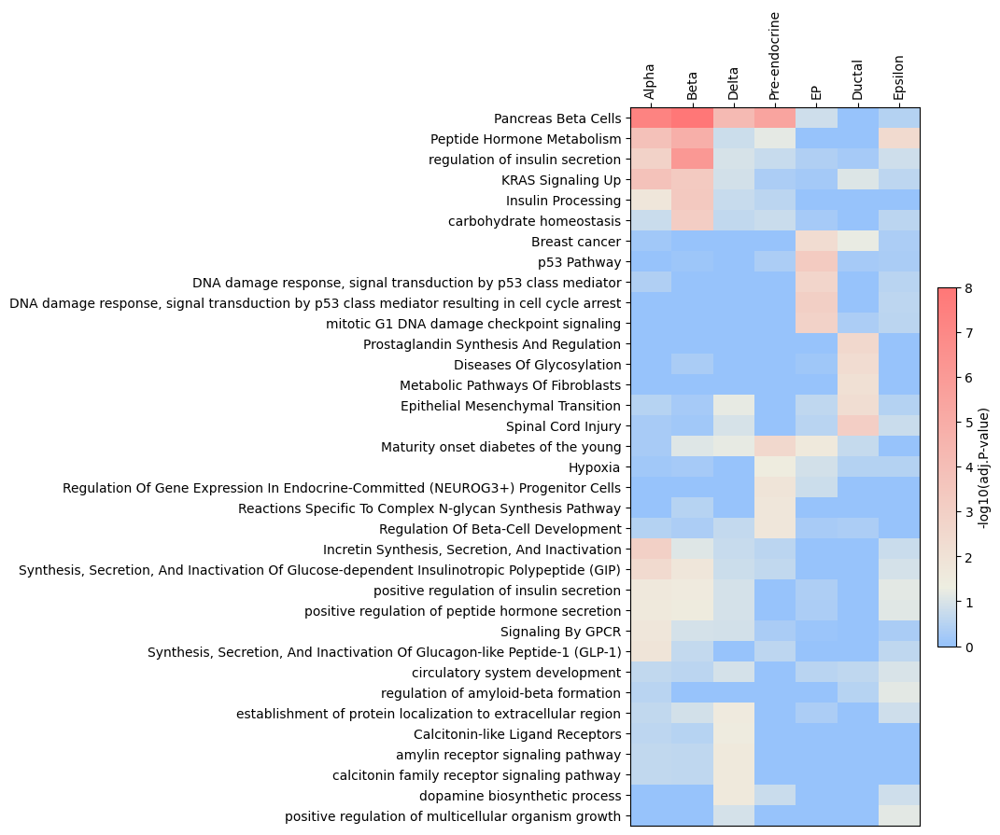

# QED
Querying  EnrichR Data
- Querying several gene sets to EnrichR at once  

> [!CAUTION]
> Critical mismatch when subsetting dataframe in heatmap function corrected.  
> Please reinstall this code if you cloned repository before <ins>***2024-01-04 14:13:38 UTC (23:13:38 GMT+9)***</ins>

<br>

##  Citation
Please cite [EnrichR](https://maayanlab.cloud/Enrichr/)

<br>

## Installation
To install the QED package, follow these steps:

1. Clone the repository (Or download this repository):
    ```
    git clone https://github.com/Irrationall/QED.git
    ```
2. Navigate into the cloned repository:
    ```
    cd QED
    ```
3. Install the package:
    ```
    pip install -e .
    ```

This will install the QED package in editable mode, meaning changes to the source code will be reflected in the installed package without needing to reinstall.

<br>

## Tutorial


```python
from qed.data import readtxt, readseurat, readscanpy
from qed.data import get_enrichment_dataframes
from qed.data import merge_df
import pandas as pd
```


```python
# Import example data

alist = readtxt("./example_data/endocrinogenesis_rowside.csv", sep=",", format="rowside")
alist = readtxt("./example_data/endocrinogenesis_colside.csv", sep=",", format="colside")

# From 'FindAllMarkers' result of Seurat
alist = readseurat("./example_data/seurat_pbmc_markers.csv", sep=",", index_col=0) # You can pass any pd.DataFrame arguments

# From 'sc.tl.rank_genes_groups' result of Scanpy
alist = readscanpy(adata, adj_pval_cutoff = 0.05, lfc_cutoff = 1)

# If you want to cut gene list via 'scores' or 'logfoldchanges',
alist = readscanpy(adata, adj_pval_cutoff = 0.05, lfc_cutoff = 1, select_top_n = 20, select_order = 'scores')

```

    Execution time for readtxt: 0.0009999275207519531 seconds
    Execution time for readtxt: 0.0030002593994140625 seconds
    Execution time for readscanpy: 0.03175973892211914 seconds
    

```python
# Check geneset object
alist
```
* result

    [geneset object [name: Alpha, number of genes: 109, number of GO_dataframes: 0],  
     geneset object [name: Beta, number of genes: 159, number of GO_dataframes: 0],  
     geneset object [name: Delta, number of genes: 51, number of GO_dataframes: 0],  
     geneset object [name: Epsilon, number of genes: 68, number of GO_dataframes: 0],  
     geneset object [name: EP, number of genes: 180, number of GO_dataframes: 0],  
     geneset object [name: Ductal, number of genes: 150, number of GO_dataframes: 0],  
     geneset object [name: Pre-endocrine, number of genes: 61, number of GO_dataframes: 0]]


```python
# Example dblist of EnrichR

dblist = ['KEGG_2021_Human','Reactome_2022','MSigDB_Hallmark_2020',
          'GO_Biological_Process_2021', 'WikiPathway_2023_Human']
```


```python
# Add gene enrichment dataframe to geneset object

aalist = get_enrichment_dataframes(alist, dblist, "Celltype", n_jobs=None)
```


    Processing genesets:   0%|          | 0/7 [00:00<?, ?it/s]


```python
# Let's check geneset object again

aalist
```


* result

    [geneset object [name: Alpha, number of genes: 109, number of GO_dataframes: 5],  
     geneset object [name: Beta, number of genes: 159, number of GO_dataframes: 5],  
     geneset object [name: Delta, number of genes: 51, number of GO_dataframes: 5],  
     geneset object [name: Epsilon, number of genes: 68, number of GO_dataframes: 5],  
     geneset object [name: EP, number of genes: 180, number of GO_dataframes: 5],  
     geneset object [name: Ductal, number of genes: 150, number of GO_dataframes: 5],  
     geneset object [name: Pre-endocrine, number of genes: 61, number of GO_dataframes: 5]]


```python
# merging all dataframes at once

df = merge_df(aalist)
df.head(3)
```

| Rank | Term                              | P-value       | Odds ratio | Combined score | Overlapping genes                          | Adjusted p-value | Old p-value | Old adjusted p-value | Database             | Celltype |
|------|-----------------------------------|---------------|------------|----------------|--------------------------------------------|-------------------|-------------|------------------------|----------------------|----------|
| 1    | Pancreas Beta Cells               | 1.888850e-09  | 41.297089  | 829.546906     | [PCSK2, DPP4, SCGN, ABCC8, GCG, IAPP, ISL1] | 4.533240e-08      | 0           | 0                      | MSigDB_Hallmark_2020 | Alpha    |
| 2    | KRAS Signaling Up                 | 1.392889e-05  | 8.126650   | 90.868511      | [RBP4, PCSK1N, TSPAN7, SCG5, USH1C, CPE, SCG3, ... | 1.671466e-04      | 0           | 0                      | MSigDB_Hallmark_2020 | Alpha    |
| 3    | Myogenesis                        | 2.394210e-02  | 3.827988   | 14.286499      | [CAMK2B, NQO1, GPX3, NCAM1]                | 1.758437e-01      | 0           | 0                      | MSigDB_Hallmark_2020 | Alpha    |


```python
# Let's draw a heatmap
# Return of 'heatmap' function is fig, ax, and cbar. You can customize them with matplotlib.
# More imporved heatmap TBD

import matplotlib.pyplot as plt
from qed.pl import heatmap

fig, ax, cbar = heatmap(df=df,
        n=5,
        group_by="Celltype",
        order_by="Adjusted p-value",
        allow_duplicate=False,
        cmap='Blues',
        xlabel_rotation=60,
        vmin=0,
        vmax=6,
        cbar_kws={'shrink' : 0.5, 'label': '-log10(P-value)'})

ax.tick_params(labelbottom=False,labeltop=True)
ax.xaxis.tick_top()

plt.show()

```


```python
# You can make your own colormap

from qed.pl import generate_cmap
import numpy as np

# This example uses default settings for boundaries and colors.
# If you don’t provide any arguments to the function, these parameters will be set automatically.

cmap = generate_cmap(color_boundary=[0, -np.log10(0.05), 8],
                     colors = ["#97C3FB", "#EEEEE1","#FF7777"])

fig, ax, cbar = heatmap(df=df,
        n=5,
        group_by="Celltype",
        order_by="Adjusted p-value",
        allow_duplicate=False,
        cmap=cmap,
        xlabel_rotation=90,
        vmin=0,
        vmax=8,
        cbar_kws={'shrink' : 0.5, 'label': '-log10(adj.P-value)'})

ax.tick_params(labelbottom=False,labeltop=True)
ax.xaxis.tick_top()

plt.show()

```



